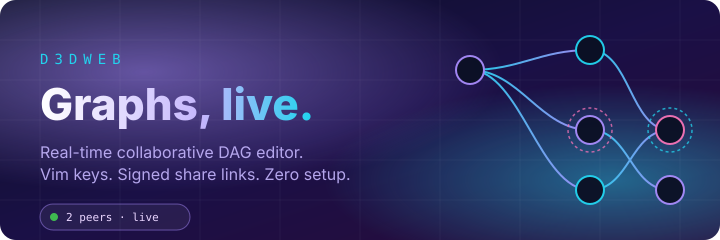
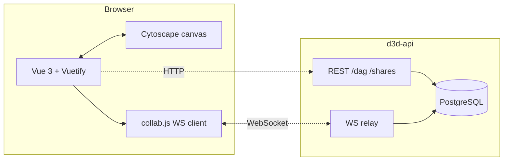

<div align="center">



# d3dweb

**Real-time collaborative DAG editor. Vim-style keys. Embeddable anywhere. AI-agent friendly.**

[](https://nodejs.org/)
[](https://vuejs.org/)
[](https://vitejs.dev/)
[](https://js.cytoscape.org/)
[](LICENSE)
[](https://www.npmjs.com/package/@d3dweb/embed)

[**Live demo**](https://d3dweb.vercel.app) · [**Landing page**](https://smetroid.github.io/d3dweb/) · [**API**](https://github.com/smetroid/d3d-api) · [**Render service**](https://github.com/smetroid/d3d-render) · [**Report bug**](https://github.com/smetroid/d3dweb/issues)

[](https://d3dweb.vercel.app/?id=29cbd78f-750a-48c7-95df-330d8316e83f)

</div>

---

## Why d3dweb

You have a graph. You want to work on it _with someone else_, right now, without setting up Miro, Figma, or Google Docs. You want to move fast with the keyboard, not a mouse. You want the whole thing to autosave, version, and be sharable via a link.

That's d3dweb.

| For **users**                                 | For **engineers / AI agents**                                   |
| --------------------------------------------- | --------------------------------------------------------------- |
| Multi-user editing with live avatars          | Vue 3 Options API — familiar and easy to fork                   |
| Vim-style `hjkl` graph navigation             | Cytoscape.js core — swap layouts or extensions freely           |
| Command palette (`⌘K`)                        | 8 layouts (Cola, CoSE, Dagre, BFS…) hot-swap `⌘+1..8`           |
| Share links with view/edit roles              | JWT share tokens with server-side revocation list               |
| Snapshot history + one-click restore          | 500ms debounced autosave with `clientId` echo prevention        |
| View-only anonymous identities (`"Teal Fox"`) | Native WebSocket relay — no Redis, no CRDT server tax           |
| **Embed diagrams in any markdown surface**    | `@d3dweb/embed` — encode graphlib JSON → URL, no account needed |
| **Fork an embedded diagram to your account**  | Agents emit graphlib JSON; d3d-render serves `image/svg+xml`    |
| Every shortcut rebindable in Settings         | release-please + Renovate + gitleaks preconfigured              |

---

## Feature matrix

<table>
<tr>
<td width="33%" valign="top">

### Live presence

Colored halos on every peer's selection. Avatar chips in the top-left HUD. Presence multiplexed through a single WebSocket room per diagram.

</td>
<td width="33%" valign="top">

### Time travel

`Shift+H` opens the history drawer — the last 50 snapshots of your diagram. Restore any one; peers reload instantly via `diagram:updated`.

</td>
<td width="33%" valign="top">

### Signed share links

`Shift+S` mints a JWT via `/shares/create`. Recipients hit `/join/:token`, the API validates against a revocation list, and the token lands in localStorage.

</td>
<td valign="top">

### Shareable sub-graphs

Navigate to any node or edge with `hjkl`, then press `Shift+O` (or open the actions menu `a` → Share Selection). Choose audience (public / me / company / group), scope depth, and expiry, then generate a signed link that shares just that element and its connected sub-graph.

Switch between node and edge navigation with `Shift+N` / `Shift+E` before invoking the share dialog.

</td>
</tr>
<tr>
<td valign="top">

### Keyboard first

`hjkl` for directional nav, `e` to edit, `x` to delete, `n` for new node, `d` for new edge, `f` for hint mode, `⌘K` for command palette. Every default is rebindable.

</td>
<td valign="top">

### Eight layouts, one keystroke

Cola, CoSE, Breadth-First, Grid, Circle, Concentric, Dagre, Random — switch with `⌘+1..8`. Choice persists per-diagram.

</td>
<td valign="top">

### Anonymous by default

View-only guests get a random display name server-side. No sign-up, no email, no PII. Names persist per share in `localStorage`.

</td>
</tr>
</table>

---

## Embed in GitHub / anywhere

Paste a d3dweb diagram into any markdown surface — GitHub READMEs, wikis, Notion, Confluence — with a single image tag. No login required to view.


> Click the image to open it in the live editor.

### Portable embed (no account needed)

The diagram is encoded directly in the URL. Copy the snippet from **Share → Embed → Inline** inside d3dweb, or generate it with `@d3dweb/embed`:

```markdown

```

### Public embed (stable, revocable)

Save the diagram to your account, toggle it public in **Share → Embed → By ID**, and use:

```markdown

```

The `?id=` embed updates automatically when you edit the diagram. Toggle public off to revoke access instantly.

|                 | `?src=` Portable     | `?id=` Public              |
| --------------- | -------------------- | -------------------------- |
| Auth required   | No                   | Owner only (to set public) |
| Updates on edit | No — snapshot in URL | Yes — live                 |
| Revocable       | No                   | Yes                        |
| Size limit      | 4 KB encoded         | Unlimited                  |

---

## For AI agents

d3dweb diagrams are graphlib JSON — a format any LLM can emit. No account, no DSL, no tool-specific syntax.

**Wire format** (3 required fields):

```json
{
  "options": { "directed": true, "multigraph": false, "compound": false },
  "nodes": [
    { "v": "build", "value": { "label": "Build" } },
    { "v": "test", "value": { "label": "Test" } },
    { "v": "deploy", "value": { "label": "Deploy" } }
  ],
  "edges": [
    { "v": "build", "w": "test", "value": { "label": "on push" } },
    { "v": "test", "w": "deploy", "value": { "label": "on pass" } }
  ]
}
```

**Generate a shareable URL** with `@d3dweb/embed`:

```js
import { encode, embedUrl } from '@d3dweb/embed'

const url = embedUrl({ src: encode(graphlibJson) })
// → https://d3dweb.vercel.app/?src=<encoded>
// Hand this URL to the user. No auth required.
```

The user opens the URL in d3dweb, sees the diagram in view-only mode, and can click **"Fork to my account"** to save and edit it.

**Render to SVG/PNG** (for embedding in documents or reports):

```
GET https://d3d-render.vercel.app/svg?src=<encoded>&layout=dagre&theme=dark
GET https://d3d-render.vercel.app/png?src=<encoded>&width=1200
```

---

## Architecture



The client is dumb-ish: it renders, it emits, it saves. The API owns identity, persistence, and the WebSocket fan-out. A single `clientId` claim on every save prevents the sender from replaying their own change.

---

## Quick start

```bash
# 1. Clone and install
git clone https://github.com/smetroid/d3dweb.git
cd d3dweb
npm install

# 2. Start d3d-api in another terminal (see its README)

# 3. Point the client at it
cat > .env.local <<EOF
VITE_COLLAB_ENABLED=true
VITE_API_BASE_URL=http://localhost:3001
EOF

# 4. Go
npm run dev  # http://localhost:5173
```

Create a user via the `d3d-api` `createuser` CLI, log in, and start dragging nodes.

---

## Environment variables

| Variable              | Default                 | Description                                                 |
| --------------------- | ----------------------- | ----------------------------------------------------------- |
| `VITE_COLLAB_ENABLED` | `false`                 | Enables WS collab, presence HUD, history panel, share links |
| `VITE_API_BASE_URL`   | `http://localhost:3001` | Base URL for d3d-api                                        |

---

## Keyboard shortcuts

Everything is one key away. All defaults are user-rebindable via **Settings** (`Ctrl+t`).
Mac uses `⌘` for the modifier; other platforms use `Alt`. All mutating shortcuts auto-disable in view-only mode.

### Navigation & selection

| Key       | Action                               |
| --------- | ------------------------------------ |
| `j` / `k` | Focus next / previous element        |
| `h` / `l` | Focus left / right                   |
| `Enter`   | Select (double-tap for multi-select) |
| `f`       | Show element hints (jump-to overlay) |
| `Esc`     | Change focus / close panels          |
| `⌘K`      | Command palette (also `Ctrl+K`)      |

### Editing

| Key   | Action                            |
| ----- | --------------------------------- |
| `n`   | Add node                          |
| `d`   | Add edge                          |
| `e`   | Edit focused node or edge         |
| `x`   | Delete focused node or edge       |
| `y`   | Copy focused node                 |
| `r`   | Toggle read-only mode             |
| `⌘⇧S` | Save form (node / edge / diagram) |
| `⌘⇧W` | Clear label field                 |

### Collaboration

| Key  | Action             |
| ---- | ------------------ |
| `⇧H` | Open history panel |
| `⇧S` | Open share dialog  |

### Zoom & pan

| Key  | Action    |
| ---- | --------- |
| `⌘=` | Zoom in   |
| `⌘-` | Zoom out  |
| `⌘h` | Pan left  |
| `⌘l` | Pan right |
| `⌘j` | Pan down  |
| `⌘k` | Pan up    |

### Menus & views

| Key      | Action            |
| -------- | ----------------- |
| `m`      | Open main menu    |
| `a`      | Open actions menu |
| `t`      | Toggle theme      |
| `/`      | Show help HUD     |
| `⌘L`     | Login             |
| `Ctrl+t` | Open settings     |

### Diagrams (Alt on non-mac, ⌘ on mac)

| Key  | Action       |
| ---- | ------------ |
| `⌘N` | New diagram  |
| `⌘O` | Open diagram |
| `⌘E` | Edit diagram |
| `⌘S` | Save diagram |

---

## Layouts

d3dweb ships with **8 built-in Cytoscape layouts**. Switch instantly with `⌘+1..8` (or `Alt+1..8` on non-mac). Choice persists per-diagram.

| Shortcut | Layout                    | Best for                                 |
| -------- | ------------------------- | ---------------------------------------- |
| `⌘+1`    | **Cola** (physics-based)  | Organic, force-directed with constraints |
| `⌘+2`    | **CoSE** (force-directed) | Compound graphs, hierarchical clusters   |
| `⌘+3`    | **Breadth First** (tree)  | Trees, BFS visualizations                |
| `⌘+4`    | **Grid**                  | Alphabetical / index-style views         |
| `⌘+5`    | **Circle**                | Small graphs, cycle emphasis             |
| `⌘+6`    | **Concentric**            | Center-out importance ranking            |
| `⌘+7`    | **Dagre** (hierarchical)  | DAGs, pipelines, dependency trees        |
| `⌘+8`    | **Random**                | Force-solver seeding                     |

---

## Roles

| Role   | Can edit | Can share | Can see presence | Badge shown |
| ------ | :------: | :-------: | :--------------: | :---------: |
| `edit` |    ✓     |     ✓     |        ✓         |      —      |
| `view` |    —     |     —     |        ✓         | `VIEW ONLY` |

Tokens are revocable by the owner via `POST /dag/:dag/shares/:jti/revoke`.

---

## Routes

| Path               | Description                                                 |
| ------------------ | ----------------------------------------------------------- |
| `/`                | Main DAG editor                                             |
| `/join/:token`     | Share link exchange — validates token, redirects to diagram |
| `/collab-poc`      | Dev POC: Yjs text sync (internal)                           |
| `/collab-cyto-poc` | Dev POC: Cytoscape collab spike (internal)                  |

---

## Project structure

```
src/
├── components/
│   ├── DiagramGraphView.vue   # Main canvas, keyboard handler, collab HUD
│   ├── HistoryPanel.vue       # Snapshot list and restore
│   ├── ShareDialog.vue        # JWT share link generator
│   ├── JoinView.vue           # /join/:token exchange
│   └── D3{Node,Edge}Form.vue  # Entity edit forms
├── services/
│   ├── api.js                 # Axios wrapper for d3d-api
│   └── collab.js              # WS singleton: presence, echo prevention
├── helpers/
│   ├── DiagramGraph.js        # Cytoscape model, layout, autosave
│   ├── CytoscapeRenderer.js   # Peer selection halos
│   └── D3Util.js              # Shared utilities
└── router/index.js
```

---

## Scripts

```bash
npm run dev       # Vite dev server
npm run build     # Production build (runs gen-icons first)
npm run preview   # Preview production build
npm run lint      # ESLint (auto-fix)
npm run test      # Vitest
npm run format    # Prettier
```

---

## Deployment

CI runs lint + tests on every push.
`release-please` cuts semver releases from Conventional Commits.
Renovate keeps dependencies fresh. Gitleaks scans every push for secrets.
Husky + lint-staged enforce format on commit.

See `.github/workflows/` for the pipelines.

---

## Contributing

PRs welcome. Use [Conventional Commits](https://www.conventionalcommits.org/) — release-please depends on them.

```
feat: add node color picker
fix(collab): prevent double-echo on rapid drag
chore(deps): bump vuetify to 3.7.4
```

---

<div align="center">

Built by [@smetroid](https://github.com/smetroid) · MIT licensed

</div>
